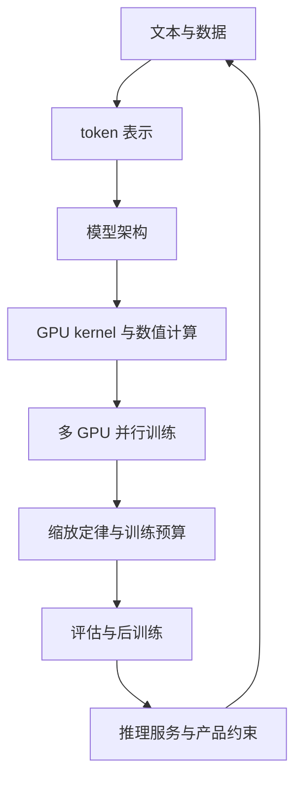

这篇文章不是第十八讲，也不是把前面十七讲的标题重新排列一遍。它回答的是一个更重要的问题：**当你把 CS336 学完之后，应该用什么结构理解一个语言模型？**

课程表面上从 tokenization 开始，最后讲到多模态；但真正的主线只有一条：把一个抽象的概率模型，逐层变成能够在真实硬件上训练、评估、服务和迭代的系统。每一层都在改变下一层的约束，任何“只优化模型结构”的方案，最终都要回到数据、内存、通信、延迟和可验证性上。

## 一张全局地图

箭头不是一次性的流水线，而是反馈回路。推理阶段发现 KV Cache 太大，会反过来影响注意力结构；评估发现模型只会背诵，会反过来改变数据混配；训练不稳定，会迫使你重新审视初始化、归一化、精度和 kernel 的实现。CS336 的价值就在于把这些原本分散的决定放进同一个闭环。

## 1. token 不是文本的缩小版

语言模型看到的不是“字”“词”或“句子”，而是一串离散 token。tokenizer 决定了文本如何进入模型，也决定了序列长度、词表 embedding 的大小、训练吞吐、上下文窗口和推理成本。

因此，tokenization 从来不是预处理脚本里的小细节。一个 tokenizer 至少同时优化四件事：

- **压缩率**：同一段文本需要多少 token，直接影响 attention 的二次复杂度和 KV Cache 容量。
- **边界稳定性**：空格、换行、Unicode、数字和代码的切分是否稳定，决定模型能否学习可复用的模式。
- **词表成本**：词表越大，embedding 与输出投影的参数、内存和通信成本越高。
- **跨域覆盖**：自然语言、代码、数学表达式和多语言文本不能只用英语语料的统计规律解释。

这也是为什么“上下文长度”不能只看模型配置中的一个整数。有效上下文取决于 token 化后的长度、注意力实现、KV Cache 的表示精度和服务端是否能承受这部分内存。

## 2. 架构选择本质上是在分配预算

Transformer 架构看起来像一组固定模块：embedding、attention、MLP、normalization 和 residual connection。但真正的架构设计是在回答：**有限的参数、FLOPs、显存和通信预算，应该花在哪里？**

注意力承担 token 间的信息交换，MLP 承担更局部的非线性变换。增大 hidden size、层数、头数、上下文长度或专家数量，都会改变模型的表达能力，但也会改变训练和推理的瓶颈。

注意力替代方案与 MoE 讨论的不是“有没有更先进的模块”，而是不同的预算分配方式：

- 线性或混合注意力试图降低长序列下的交互成本；
- 稀疏注意力把全部 token 对全部 token 的连接，变成有结构的局部或块级连接；
- MoE 用稀疏激活把参数容量与每 token 计算量分离，但引入路由、负载均衡、通信和容量溢出问题；
- 循环架构用更少的参数重复计算，换取更高的有效深度，同时必须处理状态稳定性和训练缩放问题。

所以评价一种架构不能只看验证集 loss。至少要同时问：训练 FLOPs 是多少？显存峰值在哪里？通信是否成为瓶颈？decode 时权重是否必须反复从 HBM 读取？模型能否在目标硬件上稳定运行？

## 3. GPU 性能首先是数据搬运问题

从 PyTorch、einops、FLOPs、算术强度到 Triton 和 FlashAttention，课程一直在强调一个事实：**数学上等价的程序，硬件上的代价可能完全不同。**

一个 kernel 的速度不是由 FLOPs 单独决定的，而是由计算量、内存访问、访存合并、缓存命中、线程块布局、同步和 launch 开销共同决定。可以用 roofline 的方式先问两个问题：

1. 这个操作的算术强度，即每搬运一个字节做多少计算，是否足以把 GPU 算力吃满？
2. 如果算术强度不够，能否减少中间张量、融合操作、改变 tile 布局或提高数据复用？

FlashAttention 的关键并不是发明了新的 attention 数学公式，而是改变了 attention 矩阵的物化方式：分块加载 Q、K、V，在片上存储中完成局部计算和在线 softmax，避免把巨大的中间矩阵反复写回 HBM。这个思路可以迁移到很多算子：先找出不必要的中间表示，再让数据尽可能停留在离计算单元更近的层级。

Triton、PTX 和 XLA 也不是互相替代的“语言排名”。它们代表不同的控制粒度：高级编译器擅长自动融合和通用调度，Triton 适合表达结构化 kernel，PTX 则允许你直接面对硬件指令和寄存器约束。工程选择取决于性能收益是否足以覆盖维护成本。

## 4. 多 GPU 训练是在计算与通信之间找平衡

单卡模型扩大之后，问题不再只是“把模型复制几份”。数据并行、张量并行、流水线并行、ZeRO/FSDP、专家并行和上下文并行，分别切分不同的维度。

可以用三个问题理解它们：

- **谁持有参数？** 决定参数、梯度和优化器状态的显存占用。
- **谁处理 token？** 决定每张卡的计算量与 batch 组织方式。
- **谁需要交换激活？** 决定通信量、同步点以及网络拓扑的敏感性。

并行策略的理论吞吐不是实际吞吐。一个方案即使算力利用率很高，只要在每个 micro-batch 之间等待跨节点 all-reduce，端到端速度仍可能很差。流水线并行还要处理 bubble；MoE 还要处理 token dispatch；上下文并行则会把序列维度上的通信带进 attention。

因此，分布式训练的优化顺序通常是：先测量每个阶段的计算、通信和等待时间，再决定是否改变并行维度。没有 profile 的并行配置，只是把猜测写进 YAML。

## 5. 缩放定律把“感觉”变成预算

缩放定律的意义不是给出一个永远正确的幂律指数，而是帮助我们在训练前做资源决策：模型多大、数据多少、训练多久、学习率和 batch size 如何随规模变化。

Kaplan 与 Chinchilla 的差异说明，结论依赖于预算定义和实验范围。只扩大参数而不增加足够数据，会把计算花在过大的模型上；只扩大数据而不提高模型容量，又可能让模型在表达能力上受限。真正重要的是 iso-FLOP 比较：在相同训练计算预算下，哪一种参数—数据—训练步数组合能得到更低的损失，并且这种趋势能否外推到目标规模。

优化器、学习率、临界 batch size、muP 初始化和数据重复率，都是缩放问题的一部分。它们共同决定“增加一块 GPU”究竟是在增加有效训练，还是只是在更快地重复低效工作。

## 6. 数据和评估决定模型学到什么

数据部分把一个经常被忽略的事实摆到台面上：模型能力上限往往不是由网络结构决定，而是由数据的来源、过滤、去重、混配和法律边界决定。

数据质量至少有四个维度：内容质量、覆盖范围、重复程度和污染风险。清洗过度会删除少数语言、代码和专业知识；清洗不足会把垃圾、模板、泄漏答案和版权风险带进训练集。去重也不是单一的字符串比较，而是要在 exact、近似和语义层级之间选择成本与召回率。

评估同样不能被一个 perplexity 概括。困惑度适合观察语言建模目标，但不能直接代表事实性、推理、工具调用、代码能力、安全性或 agent 工作流中的稳定性。一个可信的评估体系必须区分：

- 训练目标是否改善；
- 未见过的任务是否泛化；
- 多轮交互是否保持一致；
- 模型是否被 benchmark 污染；
- 指标变化是否真的对应用户价值。

## 7. 后训练改变的是行为接口

预训练得到的是一个拥有广泛知识和模式能力的基座模型，但它不会自动成为一个好用的助手。SFT、偏好优化、RLHF、DPO、RLVR 和安全对齐，实际上是在修改模型如何选择输出，而不只是继续降低 next-token loss。

后训练的难点在于目标经常互相冲突：更长的思考可能提升推理，却增加延迟和成本；更强的拒答策略可能降低风险，也可能伤害正常任务的可用性；奖励模型越强，过优化和 reward hacking 的风险越高。

因此，后训练应该被看成一个闭环：定义行为目标，构造数据或奖励，训练模型，使用独立评估发现副作用，再回到数据和目标修正。没有独立评估的“对齐成功”，往往只是模型学会了训练集的表面格式。

## 8. 推理是模型真正进入世界的地方

训练优化的是一批 token 的总体效率，推理服务面对的是不同长度、不同优先级、不同到达时间的真实请求。prefill 通常更接近计算密集型批处理，decode 则常常受模型权重读取和 KV Cache 访问限制。两者的瓶颈不同，所以才会出现 continuous batching、prefix caching、prefill/decode disaggregation、speculative decoding、量化和 Megakernel 等系统技术。

推理系统最终要优化的不是一个数字，而是一组用户可感知的约束：TTFT、每 token 延迟、吞吐、尾延迟、GPU 利用率、显存占用和服务成本。一个模型即使 benchmark 分数更高，只要无法在目标延迟和预算下稳定服务，就不一定是更好的工程选择。

## 最后：把每一层的局部最优放回闭环

CS336 最值得带走的不是某个模型名字、某个 kernel 技巧或某条 scaling law，而是一种检查顺序：

1. 先问表示是否合理：tokenizer、序列长度和数据覆盖是否支持目标任务？
2. 再问计算是否合理：架构的参数、FLOPs、内存和通信预算是否匹配？
3. 再问系统是否能实现：kernel、精度、并行策略和硬件拓扑是否真的跑得起来？
4. 最后问模型是否有用：评估、后训练、推理和产品指标是否闭环？

沿着这条主线回看[课程概览与 tokenization](/collections/cs336/lecture-01-course-overview-tokenization)、[架构](/collections/cs336/lecture-03-architectures)、[GPU 与 kernel](/collections/cs336/lecture-05-gpus-tpus)、[并行训练](/collections/cs336/lecture-08-parallelism)、[数据](/collections/cs336/lecture-14-data)、[后训练](/collections/cs336/lecture-16-post-training-rlvr)和[推理](/collections/cs336/lecture-10-inference)，你会发现它们并不是七个孤立专题，而是同一个系统在不同边界上的投影。

