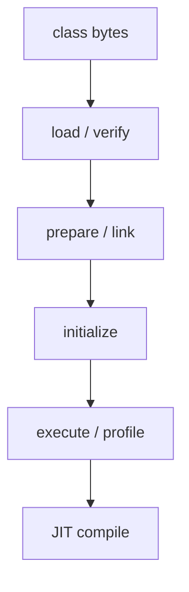

Java 的长期优势来自动态性：类按需加载，调用点在运行时收集 profile，JIT 根据真实行为编译热点代码，GC 与运行时可以针对机器和负载持续优化。

代价也来自同一个地方。

一个短命令行工具、冷启动函数或刚扩容的微服务，还没处理第一批业务流量，就要完成大量重复工作：

- 搜索、读取和解析 class 文件；
- 验证 bytecode；
- 创建运行时 class metadata；
- 链接符号引用；
- 初始化部分对象图；
- 解释执行代码并收集 method profile；
- 等热点足够明确后再触发 JIT 编译。

传统 HotSpot 用“先慢后快”换取峰值性能。Project Leyden 的目标不是放弃这套动态优化，而是把每次启动都会重复、结果又足够稳定的计算提前完成，并把结果保存为可复用的 AOT cache。

一句话概括：

> Leyden 不是把 Java 彻底静态化，而是给动态 JVM 增加一条时间轴，让过去一次受控运行的知识可以服务未来启动。

## Leyden 真正优化的三个阶段

讨论“启动快”时，至少要区分三个指标：

| 阶段 | 典型问题 | Leyden 的方向 |
|---|---|---|
| startup | 进程到应用可服务需要多久 | 缓存类加载、链接与安全对象 |
| warmup | 启动后多久达到稳定吞吐与延迟 | 提前提供 method profile，尽早编译热点 |
| footprint | 为上述动态工作保留多少 CPU、内存与 metadata | 共享、压缩并避免重复计算 |

只测“main 方法第一行出现”的时间不够。Spring 服务真正关心的是 readiness，FaaS 关心首个请求延迟，弹性扩容还关心新实例进入稳态前是否拖高 p99。

Leyden 的价值因此不是一个单一启动数字，而是缩短从进程创建到可承载真实流量、再到稳定峰值性能的整条路径。

## 它不是传统意义上的静态 AOT 编译

“AOT”很容易让人想到把所有 bytecode 预先编译为本地机器码。Leyden 当前进入主线 JDK 的成果并不是这一模型。

截至 JDK 27，核心路径是：

- JDK 24，JEP 483：Ahead-of-Time Class Loading & Linking；
- JDK 25，JEP 514：简化 AOT cache 的命令行工作流；
- JDK 25，JEP 515：Ahead-of-Time Method Profiling；
- JDK 26，JEP 516：让 AOT 对象缓存支持任意 GC，包括 ZGC。

它保存的是类、链接状态、部分对象与运行 profile 等 JVM 可复用知识；部署时仍运行 HotSpot，仍可动态加载类、解释执行和 JIT 编译。

这与“构建出一个不再需要 JVM 动态机制的原生可执行文件”不是同一件事。

## 核心工作流：训练、组装、部署

Leyden 的 AOT cache 建立在三个逻辑阶段上：


### 训练运行

用具有代表性的路径启动应用，让 JVM 观察：

- 哪些类被加载；
- 哪些符号完成解析与链接；
- 哪些方法被调用以及调用形态；
- 哪些可安全提前计算的对象进入缓存候选。

训练不是 benchmark warmup 的别名。它是生成部署制品的一部分，其覆盖率会影响 cache 命中与 warmup 效果。

### 组装

JVM 根据训练信息构造二进制 AOT cache，将可以跨运行复用的状态编码进去。它必须过滤依赖本次进程地址、随机数、时钟、文件描述符和外部环境的状态。

### 部署运行

生产进程加载与自己严格匹配的 cache。命中的类和 profile 不必重新从零建立；训练中没覆盖到的路径仍可像普通 JVM 一样动态加载、解释和 JIT。

这条 fallback 很重要：Leyden 不是要求应用成为封闭世界，而是让稳定部分先到达更靠后的运行状态。

## JDK 25 之后的两步使用方式

JEP 514 将用户工作流简化为“生成 cache + 使用 cache”。一个最小示意如下：

```bash
# 训练应用；进程结束时生成 AOT cache
java \
  -XX:AOTCacheOutput=app.aot \
  -cp app.jar \
  com.example.Main

# 部署时加载 cache
java \
  -XX:AOTCache=app.aot \
  -cp app.jar \
  com.example.Main
```

训练运行必须真正走过代表性路径。对于 Web 服务，不能只让 Spring 打印出 `Started Application` 就退出；通常还要等待 readiness，并发送一组稳定、无副作用或可隔离的训练请求。

```bash
java \
  -XX:AOTCacheOutput=service.aot \
  -jar service.jar &

training_pid=$!

# 等待健康检查，再执行受控训练流量
# curl 调用训练端点后，让应用正常关闭，使 JVM 写出 cache
kill -TERM "${training_pid}"
wait "${training_pid}"
```

生产脚本必须把失败视为制品构建失败，而不是悄悄退回无 cache 运行。还需要记录 JDK build、应用 digest、训练场景版本与 cache hash。

## JEP 483：缓存的不是 class 文件，而是加载与链接后的状态

普通 JVM 启动时，即使 JAR 没变，也会重新读取和处理大量 class：

1. 找到 classpath/module path 上的字节；
2. 解析 class-file 结构；
3. 验证 bytecode 与类型约束；
4. 在 HotSpot 中创建类元数据；
5. 准备静态字段和运行时结构；
6. 解析一部分符号引用。

JEP 483 在 CDS/AppCDS 基础上继续前移，缓存应用类的 loaded 与 linked 状态。部署运行可以直接利用这些结果，而不是只共享原始或较早阶段的 metadata。

可以把类生命周期粗略看成：



Leyden 逐步把安全、可复现的边界从左向右推进，但不会无条件越过所有初始化。类初始化可以执行任意 Java 代码，读取环境、网络、密钥或当前时间；这种行为不能简单冻结后复制到另一台机器。

## JEP 515：把“哪些方法会热”也带到下一次启动

只减少类加载仍不能解决 warmup。HotSpot 通常要先解释或低层编译方法，收集调用次数、分支概率、类型分布和调用点形态，再决定哪些方法值得高级优化。

JEP 515 将训练运行中的 method profile 存入 AOT cache。部署 JVM 启动后可以更早知道：

- 哪些方法很可能成为热点；
- 某个虚调用点通常出现哪些 receiver type；
- 分支大致偏向哪一侧；
- 哪些调用链值得优先编译。

这不等于直接复用训练机器生成的最终机器码。JIT 仍在部署环境中编译，因此可以针对实际 CPU、JVM flags 和运行情况优化，也能在假设失效时 deoptimize。

其工程价值主要体现在 time-to-peak：新 pod 不必完全靠第一批真实用户替 JVM“交学费”。

但 profile 可能陈旧。训练流量若只覆盖管理员接口，却遗漏核心下单路径，JVM 会优先优化错误的热点。HotSpot 最终仍能通过在线 profile 修正，只是 AOT cache 的收益下降，甚至可能带来额外编译与反优化成本。

## JEP 516：为什么对象缓存曾经依赖 GC

AOT cache 不只包含纯元数据，还可能包含预先创建的 Java 对象。对象内部有引用，引用表示方式、对象布局和 GC barrier 与收集器实现密切相关。

早期方案可以把某些缓存对象以接近目标 heap 形态的方式映射进内存，但这种格式与特定 GC 紧密耦合，因此不能自然支持所有收集器。

JEP 516 在 JDK 26 引入 GC-neutral 的对象缓存表示。cache 中的引用用逻辑关系表达，部署 JVM 再将对象流式物化到当前 GC 管理的 heap，并重建真实引用。

概念上是：

```text
缓存中的中立对象图
        ↓ 解析与物化
当前 GC 的 heap 对象
        ↓
G1 / ZGC / Serial / Parallel / ...
```

这样 Leyden 的对象缓存不再要求部署选择某个特定 GC，ZGC 也可以参与 AOT cache 路径。

代价是“直接映射”与“启动时物化”之间需要权衡。GC-neutral 设计扩大兼容性，但对象仍要进入当前 heap，引用仍需建立，不能把对象缓存理解成零成本 mmap。

## AOT cache 到底可以放什么

适合缓存的是满足两个条件的计算结果：

1. 对未来部署运行仍然有效；
2. 恢复它比重新计算更便宜。

典型内容包括：

- 已加载、验证与链接的类状态；
- 运行时使用的类元数据；
- JVM 判定可安全归档的对象；
- 训练期间收集的方法执行 profile；
- 支撑上述状态的符号与引用关系。

不应该把它理解为应用 heap 快照。下面这些状态通常不能直接跨运行冻结：

- socket、文件描述符和线程；
- 数据库连接池；
- 当前时间与随机 nonce；
- 临时目录和机器 IP；
- 从 Vault/KMS 读取的 secret；
- 与本次部署租户绑定的缓存；
- native library 的进程内地址。

JVM 负责技术安全检查，应用团队仍要负责训练流程不接触敏感数据，也不能把构建期外部状态误当成生产真相。

## 与 CDS / AppCDS 的关系

Leyden 不是从零开始。HotSpot 很早就有 Class Data Sharing：把处理后的类元数据放进共享 archive，让多个 JVM 更快加载，并在某些情况下共享只读页面。

| 能力 | 主要保存什么 | 重点 |
|---|---|---|
| CDS | JDK 核心类的共享元数据 | 减少启动与内存重复 |
| AppCDS | 应用类的共享元数据 | 扩展到应用 classpath |
| Leyden AOT cache | 更深入的类加载/链接状态、对象、method profile | 同时改善 startup 与 warmup |

可以把 Leyden 看成沿着 CDS 基础设施继续推进的时间前移，而不是一个完全独立的新 VM。

这也解释了为什么 cache 对版本和输入很敏感：它保存的不是可跨任意 JVM 解释的普通配置文件，而是与 HotSpot 内部状态紧密关联的部署制品。

## 与 GraalVM Native Image 的区别

二者都追求更快启动和更低初始资源开销，但选择了不同约束。

| 维度 | Leyden AOT cache | GraalVM Native Image |
|---|---|---|
| 运行载体 | HotSpot JVM | 原生可执行文件 + Substrate VM |
| 世界假设 | 保留开放、动态 fallback | 构建期尽量闭合 reachable world |
| JIT | 保留 | 通常没有传统 HotSpot JIT |
| 动态类加载 | 未命中路径可正常发生 | 受 closed-world 与配置约束 |
| 峰值优化 | 保留在线 profile、JIT 与 deoptimization | 依赖静态编译与 PGO 等构建能力 |
| 构建复杂度 | 训练并生成匹配 cache | native-image 分析、配置与 native link |
| 启动目标 | 显著减少 HotSpot 重复工作 | 极快 native process startup |

Leyden 更像“仍然是 Java，只把确定工作提前”；Native Image 更像“把应用变成一个受封闭世界约束的 native program”。

框架反射、动态代理和运行时生成代码很多时，Leyden 的迁移成本通常更低；对极致冷启动、低 RSS 的函数或 CLI，Native Image 仍可能更有优势。必须用真实应用测量，不能只按技术名字选边。

## 与 CRaC 的区别

CRaC（Coordinated Restore at Checkpoint）在应用已经启动并预热后保存整个进程的 checkpoint，之后恢复到接近当时的运行状态。

| 维度 | Leyden | CRaC |
|---|---|---|
| 保存对象 | 可安全提前计算的 JVM 状态 | 接近完整进程状态 |
| 恢复粒度 | JVM 启动时加载 AOT cache | OS/JVM 恢复 checkpoint |
| 外部资源 | 不试图保存活连接 | checkpoint 前必须协调关闭，restore 后重建 |
| 可移植性 | 受 JDK、平台与制品匹配约束 | 更依赖 OS/kernel/runtime 环境 |
| 思路 | computation shift | process snapshot/restore |

CRaC 可能获得更激进的恢复速度，但需要数据库连接、随机源、文件和网络在 checkpoint/restore 生命周期中协作。Leyden 不恢复一个“暂停的生产进程”，因此状态治理更保守。

两者不是简单替代关系，但部署链路的复杂度、镜像大小与可重复性需要单独评估。

## 训练运行是最重要的工程环节

一个高质量训练集不追求覆盖所有代码，而要覆盖启动和早期流量中稳定、昂贵、常见的路径。

### 应该覆盖

- framework bootstrap 与 dependency injection；
- JSON serializer/deserializer 建立；
- ORM metadata 与常用 query path；
- HTTP route、filter 与认证基础链；
- 高频业务入口；
- 正常 shutdown，确保 cache 正确写出。

### 应该隔离

- 真实支付、发券、通知等副作用；
- 生产 secret 与租户数据；
- 非确定性故障注入；
- 一次性 migration 与管理端全量扫描；
- 只在测试依赖中出现的 classpath。

训练环境要尽量接近生产，但不能直接把生产请求回放到有副作用的真实下游。更好的方式是提供 deterministic training mode、mock adapter 或只读影子环境。

## Cache 不是跨版本永久资产

AOT cache 应被视为应用构建产物，而不是长期数据文件。

这些变化通常都应重新生成 cache：

- JDK vendor、版本或 build 改变；
- JAR 内容、顺序、路径或时间戳改变；
- classpath/module path 改变；
- JVM flags、GC 或影响运行布局的选项改变；
- native dependency 和目标架构改变；
- 训练场景发生实质变化。

不要让 pod 在生产启动时自行训练并覆盖共享 cache。正确流程是 CI/CD 生成、验证、签名并随应用制品一起发布；生产只读加载。

建议记录一个 manifest：

```json
{
  "applicationDigest": "sha256:...",
  "jdk": "27+...",
  "architecture": "linux-aarch64",
  "trainingScenario": "checkout-v3",
  "cacheDigest": "sha256:..."
}
```

部署前做一致性检查，比启动失败后再从 JVM 日志猜 cache 为什么失效更可靠。

## 容器与 Kubernetes 中的真实收益

Leyden 对短生命周期与弹性部署尤其有吸引力：

- pod 从启动到 readiness 更快；
- 扩容实例更早进入有效容量；
- rolling update 的重叠资源时间缩短；
- 第一批请求不再承担完整 profile 收集成本；
- 高频 CLI 与 build tool 的重复启动成本下降。

但它不能修复所有“Java 启动慢”：

- 应用同步等待数据库、配置中心和 DNS，AOT cache 无法缩短网络 RTT；
- Spring bean 自己执行昂贵 I/O，仍然需要真实运行；
- Kubernetes probe 配置错误，仍会导致错误重启；
- CPU quota 太低，cache 物化和 JIT 仍会受限；
- 镜像层过大，拉取时间可能比 JVM 启动更长。

应把时间拆成：image pull、process spawn、JVM bootstrap、framework bootstrap、外部依赖、readiness 与 warmup，而不是只报告一个总启动数。

## 性能测试应该怎么做

至少保留四组对照：

1. 普通 HotSpot 冷启动；
2. 使用 AOT cache 的冷启动；
3. 两者启动后的早期请求阶段；
4. 两者完全稳态后的峰值性能。

记录：

- process start → main；
- process start → readiness；
- first request 与前 N 个请求的 p50/p99；
- time-to-peak throughput；
- 启动阶段 CPU time、RSS、page fault 与磁盘读取；
- cache 文件大小和容器镜像增量；
- JIT compilation、deoptimization 与 code cache；
- 不同训练覆盖率的敏感度。

测试必须在目标 CPU 架构、容器 quota、文件系统和 JDK build 上进行。开发机 NVMe 上的 200 ms 改善，不一定能代表受限 Kubernetes 节点上的结果。

## 哪些项目最值得采用

### 高收益候选

- Spring Boot、Quarkus JVM mode 等类加载量大的服务；
- 扩缩容频繁的微服务；
- 对 cold start 敏感但又希望保留 HotSpot 峰值性能的工作负载；
- 高频执行、运行时间较短的 Java CLI；
- 不愿承担 Native Image closed-world 适配成本的动态应用。

### 收益可能有限

- 一次启动后运行数月的稳定大服务；
- 启动时间主要耗在远端依赖而不是 JVM；
- 动态插件集合每次运行都不同；
- 应用版本发布极少，扩缩容也很少；
- 已用 CRaC 或 Native Image 达到目标且维护成本可接受。

Leyden 不是“所有 Java 项目都必须打开”的性能开关。它增加了训练、cache 版本化和发布验证环节，收益必须覆盖供应链复杂度。

## 生产落地检查表

### 构建

- 锁定 JDK vendor、版本、build 与目标架构；
- cache 与应用 digest 一一对应；
- 训练过程可重复、可审计、无真实副作用；
- cache 生成失败会阻断发布，而不是静默忽略。

### 安全

- 训练不读取生产 secret 与用户数据；
- 检查 cache 和构建日志是否含环境特定信息；
- cache 与 JAR 一起签名、生成 SBOM 并控制写权限；
- 生产容器只读加载 cache。

### 兼容

- 目标 GC 在所用 JDK 中已验证；
- classpath、JVM flags 与训练阶段一致；
- agent、APM、instrumentation 和动态代理均进入测试矩阵；
- 升级 JDK 后重新生成并跑完整基准。

### 观测

- 分开记录 startup、readiness、warmup 和 steady state；
- 观察 cache 是否成功加载以及 fallback 原因；
- 比较早期请求的 JIT、deoptimization 与尾延迟；
- 同时测 cache 大小、镜像拉取和实例密度。

## 结论：Leyden 保留动态 JVM，但不再从零开始

Project Leyden 的方向比“Java 也做 AOT”更细腻。它不急于把 HotSpot 变成静态编译器，而是逐步识别 JVM 生命周期中可以安全前移的工作：

- JEP 483 保存类加载与链接结果；
- JEP 514 把 AOT cache 生成收束成可用的部署流程；
- JEP 515 保存方法 profile，缩短到达峰值性能的时间；
- JEP 516 用 GC-neutral 对象格式扩大对象缓存的适用范围。

动态加载、JIT、在线 profile 和 deoptimization 仍然存在，这正是 Leyden 与 Native Image 的根本分界。训练没有覆盖的代码仍可正常运行，真实负载也能修正历史 profile。

它改变的是 JVM 的起跑线：过去每个进程都必须重新学习的东西，现在可以在构建阶段学习一次，以受版本约束的 cache 带到生产。

真正成熟的 Leyden 工程不只是一条 `-XX:AOTCacheOutput` 命令，而是一套可复现的训练、无副作用的场景、严格的制品匹配和分阶段性能验证。只有这些环节都成立，提前计算才会成为可靠的部署能力，而不是另一份容易失效的神秘缓存。

## 延伸阅读

- [Project Leyden](https://openjdk.org/projects/leyden/)
- [JEP 483：Ahead-of-Time Class Loading & Linking](https://openjdk.org/jeps/483)
- [JEP 514：Ahead-of-Time Command-Line Ergonomics](https://openjdk.org/jeps/514)
- [JEP 515：Ahead-of-Time Method Profiling](https://openjdk.org/jeps/515)
- [JEP 516：Ahead-of-Time Object Caching with Any GC](https://openjdk.org/jeps/516)
- [Inside Java：Ahead of Time Computation](https://inside.java/2025/05/16/podcast-036/)
- [Inside Java：Run Into the New Year with Java's Ahead-of-Time Cache](https://inside.java/2026/01/09/run-aot-cache/)
