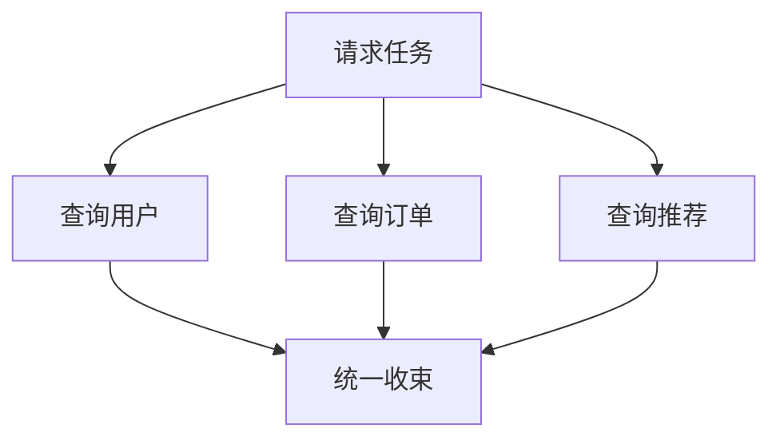

虚拟线程解决的是“一个任务占用一个线程太贵”，但没有自动解决另一个更隐蔽的问题：任务之间是什么关系。

一个请求为了生成首页，同时查询用户、订单和推荐。三个调用可以放进三个虚拟线程，但如果只是随手 `submit`：

- 谁负责等待它们；
- 一个失败后另外两个是否继续；
- 客户端断开后子任务是否取消；
- 方法返回时后台是否还残留任务；
- thread dump 能否看出它们属于同一个请求；
- 超时是约束整个操作，还是分别约束每个调用。

这些都不是虚拟线程本身能回答的。

Project Loom 的结构化并发把并发任务重新放回程序的词法结构：一个作用域创建子任务，作用域关闭前必须收束它们。并发不再是一批从调用栈上脱落的 `Future`，而是一棵有父子关系、失败策略和生命周期边界的任务树。

截至 JDK 27，虚拟线程已经是正式特性，而 `StructuredTaskScope` 仍处于第七轮预览。本文使用 JEP 533 的 JDK 27 API；编译和运行都需要 `--enable-preview`。

## 并发为什么需要“结构”

结构化编程消灭了任意 `goto`，因为代码块的入口、出口和生命周期可以局部推理。结构化并发将同一原则应用到线程：

> 如果任务 B、C 是任务 A 在某个作用域中创建的，那么 A 离开该作用域前，B、C 必须已经成功、失败或被取消。



这条约束带来几个直接结果：

- 子任务不能静默活得比父任务更久；
- 失败与取消沿任务树传播，而不是靠散落的 callback 拼接；
- 父任务的调用栈仍代表整个操作；
- 运行时和诊断工具知道哪些线程属于同一工作单元；
- 资源清理重新与 `try` 作用域对齐。

结构化并发不是一种新的调度器。它描述任务之间的所有权；虚拟线程负责让这些任务足够便宜。

## 非结构化 Future 的真正问题

传统写法通常从 `ExecutorService` 开始：

```java
Future<User> user = executor.submit(
    () -> loadUser(userId)
);

Future<List<Order>> orders = executor.submit(
    () -> loadOrders(userId)
);

return new Dashboard(
    user.get(),
    orders.get()
);
```

表面上两个调用已经并行，实际语义并不完整。假设 `user.get()` 立即失败：

- `orders` 可能继续占用数据库连接；
- 当前方法若直接抛异常，第二个任务的结果无人观察；
- 若忘记 `cancel`，任务生命周期逃出方法；
- `get()` 的顺序还会影响何时观察到失败；
- executor 的关闭通常属于应用，而不是这次请求。

`CompletableFuture` 能组合结果，但它默认仍是无结构的：stage 可以在任意地方创建、保存和继续运行，异常包装为 `CompletionException`，取消也不天然形成父子树。

问题不在 API 不够流畅，而在所有权没有进入类型与作用域。

## StructuredTaskScope 的四个角色

JDK 27 的结构化并发可以先记住四个概念：

| 概念 | 责任 |
|---|---|
| `StructuredTaskScope<T, R>` | 创建并管理一组相关子任务 |
| `Subtask<T>` | 表示一个子任务及其结果、失败或取消状态 |
| `Joiner<T, R>` | 决定何时取消、如何汇合、`join()` 返回什么 |
| `Configuration` | 设置名称、超时、线程工厂等作用域属性 |

这里最关键的设计变化是 `Joiner`。它不只是“等待策略”，而是一个小型并发协议：子任务创建和完成时它都会收到通知，可以决定是否提前取消整个 scope，最后再生产汇合结果或抛出异常。

## 最常用的模式：全部成功，否则整体失败

`StructuredTaskScope.open()` 使用默认 joiner：`awaitAllSuccessfulOrThrow()`。它适合返回类型不同、最后由调用者自己组合结果的子任务。

```java
import java.util.concurrent.StructuredTaskScope;

record Dashboard(
    User user,
    List<Order> orders
) {}

Dashboard loadDashboard(String userId)
        throws InterruptedException {
    try (var scope = StructuredTaskScope.open()) {
        var user = scope.fork(
            () -> loadUser(userId)
        );

        var orders = scope.fork(
            () -> loadOrders(userId)
        );

        scope.join();

        return new Dashboard(
            user.get(),
            orders.get()
        );
    }
}
```

语义比代码行数更重要：

1. 两个子任务通常由虚拟线程执行；
2. 任意子任务失败，默认 joiner 取消 scope；
3. 另一个尚未完成的子任务会收到中断；
4. `join()` 等待取消与任务收束，再传播失败；
5. 只有成功 `join()` 后，`get()` 才处于可安全读取的状态；
6. 离开 `try` 时，scope 不允许留下失控子任务。

这叫 **fail fast**，但不是“异常一出现，所有代码瞬间消失”。取消仍然是协作式的：被取消的子任务必须响应中断，底层驱动也必须支持释放阻塞操作。

## Joiner 是结构化并发的策略中心

JDK 27 提供几种常用策略：

| Joiner | 收束规则 | `join()` 结果 |
|---|---|---|
| 默认 / `awaitAllSuccessfulOrThrow()` | 任一失败就取消其余任务 | `Void`，结果从各 `Subtask` 读取 |
| `awaitAll()` | 等待全部任务，不因失败提前取消 | `Void`，调用方检查各子任务 |
| `allSuccessfulOrThrow()` | 全部成功，否则取消 | 按 fork 顺序返回结果列表 |
| `anySuccessfulOrThrow()` | 任一成功即取消其余任务 | 第一个成功结果 |
| `allUntil(predicate)` | 全部完成或某个完成项满足条件 | 已观察到的子任务列表 |

### 同类型结果：直接汇成 List

```java
import static java.util.concurrent
    .StructuredTaskScope.Joiner;

List<Price> queryAll(List<Supplier> suppliers)
        throws InterruptedException {
    try (var scope = StructuredTaskScope.open(
            Joiner.<Price>allSuccessfulOrThrow())) {

        for (Supplier supplier : suppliers) {
            scope.fork(
                () -> supplier.queryPrice()
            );
        }

        return scope.join();
    }
}
```

与 JDK 25 的预览版不同，JDK 26 起 `allSuccessfulOrThrow()` 直接产生按 fork 顺序排列的结果 `List`，不再返回 `Subtask` stream。预览 API 会变化，代码必须以目标 JDK 的 Javadoc 为准。

### 竞速：任一成功即可

```java
String resolveFromMirrors(List<Mirror> mirrors)
        throws InterruptedException {
    try (var scope = StructuredTaskScope.open(
            Joiner.<String>anySuccessfulOrThrow())) {

        for (Mirror mirror : mirrors) {
            scope.fork(mirror::downloadManifest);
        }

        return scope.join();
    }
}
```

这里的业务语义是“首个成功者获胜”，不是“首个完成者获胜”。一个镜像快速失败，不应该阻止其他镜像继续尝试；一旦有成功结果，其余任务才被取消。

它适合多副本读取、冗余 DNS、镜像探测等场景，但会放大下游并发，不能绕开配额和幂等性设计。

### 等待所有状态：不要默认吞掉失败

`awaitAll()` 不会因为一个子任务失败就取消 scope，也不会让 `join()` 自动传播子任务异常。它适合批处理审计、best-effort fan-out 或收集多项错误。

使用它意味着调用者主动承担状态检查责任。若只是忘了处理失败，默认的 fail-fast joiner 更安全。

## 超时应该属于整个操作

如果首页聚合的预算是 800 ms，分别给用户、订单和推荐各 800 ms，并不能保证整个请求在 800 ms 内完成。结构化作用域可以直接表达总预算：

```java
import java.time.Duration;
import java.util.concurrent.StructuredTaskScope;
import static java.util.concurrent
    .StructuredTaskScope.Joiner;

try (var scope = StructuredTaskScope.open(
        Joiner.<Object>awaitAllSuccessfulOrThrow(),
        config -> config
            .withName("dashboard")
            .withTimeout(Duration.ofMillis(800)))) {

    var user = scope.fork(
        () -> loadUser(userId)
    );
    var orders = scope.fork(
        () -> loadOrders(userId)
    );

    scope.join();
    return combine(user.get(), orders.get());
}
```

作用域超时后会取消尚未完成的子任务，并让 `join()` 按 joiner 的协议报告超时。

实践中应同时保留分层预算：

- 请求总预算约束整棵任务树；
- 单个 HTTP/JDBC 调用仍有自己的连接、读取和查询超时；
- 重试必须消耗同一剩余预算，而不是每次重新获得完整超时；
- 下游不响应中断时，需要使用其原生取消接口。

结构化超时能界定责任，不能修复一个不可取消的驱动。

## 失败传播：保留业务语义，而不是只保留包装异常

默认 joiner 在子任务失败时让 `join()` 失败。边界层应将底层异常转换为稳定领域错误：

```java
try {
    return loadDashboard(userId);
} catch (StructuredTaskScope.FailedException failed) {
    Throwable cause = failed.getCause();

    if (cause instanceof UserNotFoundException e) {
        throw e;
    }

    throw new DashboardUnavailableException(cause);
}
```

不要只在日志中打印 `FailedException` 后丢掉 cause。结构化并发改善的是失败归属，不代表业务错误模型可以省略。

还要谨慎处理多个同时失败的子任务。fail-fast 策略通常传播首先观察到的失败，其他失败可能只出现在诊断信息中。若业务需要完整错误集合，应选择 `awaitAll()` 或自定义 joiner，并明确聚合顺序与主异常。

## 取消依赖中断合作

scope 的取消最终落到子线程中断。下面这种写法会破坏整棵任务树的取消：

```java
try {
    return queue.take();
} catch (InterruptedException ignored) {
    return cachedValue;
}
```

更合理的做法是传播中断，或在转换为业务异常前恢复标志：

```java
try {
    return queue.take();
} catch (InterruptedException cancelled) {
    Thread.currentThread().interrupt();
    throw new RequestCancelledException(cancelled);
}
```

需要逐层审计：

- JDBC driver 是否响应 `Statement.cancel()` 或线程中断；
- HTTP client 取消后是否关闭或复用连接；
- native/FFM 调用是否根本无法从 Java 中断；
- CPU 循环是否定期检查中断；
- `finally` 是否会执行新的长时间阻塞清理。

结构化并发使取消路径可见，但取消的有效性仍取决于整个调用链。

## ScopedValue：上下文沿任务树继承

结构化任务天然需要共享请求 ID、租户或认证主体。`ScopedValue` 的绑定可以被子任务继承，同时保持不可变与词法范围：

```java
import java.lang.ScopedValue;

static final ScopedValue<RequestContext> CONTEXT =
    ScopedValue.newInstance();

Response handle(Request request) throws Exception {
    var context = authenticate(request);

    return ScopedValue.where(CONTEXT, context)
        .call(() -> {
            try (var scope =
                     StructuredTaskScope.open()) {
                var account = scope.fork(
                    () -> loadAccount(
                        CONTEXT.get().userId()
                    )
                );
                var policy = scope.fork(
                    () -> loadPolicy(
                        CONTEXT.get().tenantId()
                    )
                );

                scope.join();
                return authorize(
                    account.get(),
                    policy.get()
                );
            }
        });
}
```

它与可变 `ThreadLocal` 的关键差异是：子任务看见的是作用域绑定，而不是一份可被任意层修改的线程局部状态。scope 关闭、外层 `ScopedValue` 退出后，上下文一起失效。

但业务必需参数仍应优先显式传递。`ScopedValue` 适合横切上下文，不应隐藏领域输入。

## 线程工厂与虚拟线程不是强绑定

结构化并发 API 描述任务关系，不强制每个子任务必须运行在虚拟线程上。默认配置适合 Loom 的 virtual-thread-per-task 模型，也可以通过 configuration 提供自定义 thread factory。

自定义前要先回答：

- 是为线程命名、上下文桥接，还是试图重新建立固定线程池；
- CPU 密集任务是否应该进入单独的有界执行器；
- 框架是否已经包装 thread factory；
- APM/MDC 是否依赖旧式 ThreadLocal 拷贝。

把 `StructuredTaskScope` 的子任务放进一个很小的平台线程池，可能让父任务等待子任务、子任务又等待同池资源，重新引入饥饿和死锁。结构化所有权与调度资源仍需分别设计。

## 与 Kotlin 结构化并发的区别

Kotlin 从协程设计之初就把 `Job` 父子关系放进核心模型；Java 则是在 `Thread` 语义上补上结构化作用域。

| 维度 | Java `StructuredTaskScope` | Kotlin `coroutineScope` |
|---|---|---|
| 执行单元 | 通常是虚拟线程 | coroutine |
| 暂停机制 | JVM stackful continuation | 编译器 CPS 状态机 |
| 父子关系 | scope 与 subtask | `Job` 树 |
| 默认失败 | 默认 joiner fail-fast | 普通 scope 中子协程失败取消兄弟 |
| 监督模式 | 选择/实现不同 Joiner | `supervisorScope` / `SupervisorJob` |
| 上下文 | `ScopedValue`、ThreadLocal | `CoroutineContext` |
| 取消信号 | thread interruption | `Job` cancellation |
| API 状态 | JDK 27 第七轮预览 | 稳定生态能力 |

两者最相似的是生命周期不允许任意逃逸，而不是语法。

Kotlin 的 `async` 返回 `Deferred<T>`，`awaitAll` 组合结果；Java 的 `fork` 返回 `Subtask<T>`，`Joiner` 决定汇合策略。Kotlin supervision 明确区分“一个失败是否取消兄弟”；Java 把类似策略开放给 joiner。

对于 Kotlin/JVM 项目，不要同时让 `Job` 树和 `StructuredTaskScope` 管理同一批工作的取消，否则很容易出现：协程已取消但虚拟线程仍运行，或线程被中断但 `Job` 仍显示 active。边界处必须选择一个生命周期所有者，并显式桥接取消。

## 与 CompletableFuture、Reactor 的边界

结构化并发不会让所有异步抽象失去价值。

| 场景 | 更自然的模型 |
|---|---|
| 一个请求内并发调用多个阻塞服务 | 虚拟线程 + `StructuredTaskScope` |
| 长生命周期事件流、背压、窗口与操作符组合 | Reactor、Mutiny、Flow 等流模型 |
| 跨方法保存、稍后完成的 promise | `CompletableFuture`，但明确所有权 |
| CPU 并行计算 | 有界 Fork/Join、并行算法 |
| Kotlin 端到端挂起生态 | Kotlin structured concurrency |

结构化并发最适合“父操作可以清楚圈出子任务边界”的 request/response 工作。消息订阅、GUI 事件源和永不结束的数据流本来就没有单次词法作用域，不应强行套入短生命周期 task scope。

## 可观测性：任务树比线程列表更重要

一组结构化子任务属于同一个 scope，JVM 可以在 thread dump 和诊断数据中呈现这种关系。scope name 也不只是装饰，它应对应可理解的业务操作，如 `checkout`、`dashboard`、`risk-evaluation`。

观测时至少需要关联：

- 父请求与子任务树；
- scope 名称、总预算与剩余时间；
- 哪个子任务首先失败并触发取消；
- 兄弟任务响应取消花了多久；
- 下游连接池等待与实际 I/O 时间；
- 取消后仍未退出的 native 或驱动调用。

不要为每个虚拟线程创建高基数 metric label。trace/span 适合表达单次任务树；metrics 应聚合到操作名、结果类型与下游服务级别。

## 生产设计检查表

### 作用域

- 每个 fork 的任务都属于一个清楚的父操作；
- scope 关闭前不会留下后台任务；
- 不把 `Subtask` 保存到 scope 之外；
- 不在子任务中绕过父 scope 再创建无人管理的 executor 任务。

### 失败与取消

- 明确是 fail-fast、等待全部还是首个成功；
- 中断不会被第三方库或业务 catch 静默吞掉；
- 多失败场景有主异常与审计策略；
- timeout、客户端断连和应用 shutdown 能传到子任务。

### 资源

- 数据库连接、远端 QPS 与文件描述符另有背压；
- 竞速请求不会无限放大下游流量；
- 补偿、重试和幂等性不依赖“线程最终会停”；
- CPU 密集任务没有占满所有 carrier。

### 兼容性

- 构建与运行都启用相同 JDK 预览版本；
- 从 JDK 21/22/23/24 示例迁移时不照搬旧的 `ShutdownOnFailure` API；
- 升级 JDK 后重新核对 Joiner 的名称、返回类型与异常签名；
- 框架、APM 与测试工具能够理解虚拟线程和 scope。

## 结论：并发的核心不是启动，而是收束

虚拟线程让创建任务变得便宜，结构化并发让这些任务仍然可治理：

- 词法 scope 界定子任务生命周期；
- task tree 恢复父子所有权；
- Joiner 把成功、失败、竞速与聚合写成显式策略；
- interruption 与 timeout 沿树传播；
- ScopedValue 让只读上下文随结构继承；
- 诊断工具可以观察一个工作单元，而不只是海量孤立线程。

最重要的思维变化是：不要问“我能启动多少个虚拟线程”，而要问“谁拥有它们、何时必须结束、失败后谁被取消、资源预算属于哪一层”。

当这些问题能由代码结构直接回答，并发才真正从技巧变成了可维护的程序结构。

## 延伸阅读

- [JEP 533：Structured Concurrency（Seventh Preview）](https://openjdk.org/jeps/533)
- [Java 27 API：StructuredTaskScope](https://docs.oracle.com/en/java/javase/27/docs/api/java.base/java/util/concurrent/StructuredTaskScope.html)
- [Java 27 API：StructuredTaskScope.Joiner](https://docs.oracle.com/en/java/javase/27/docs/api/java.base/java/util/concurrent/StructuredTaskScope.Joiner.html)
- [JEP 506：Scoped Values](https://openjdk.org/jeps/506)
- [JEP 444：Virtual Threads](https://openjdk.org/jeps/444)
