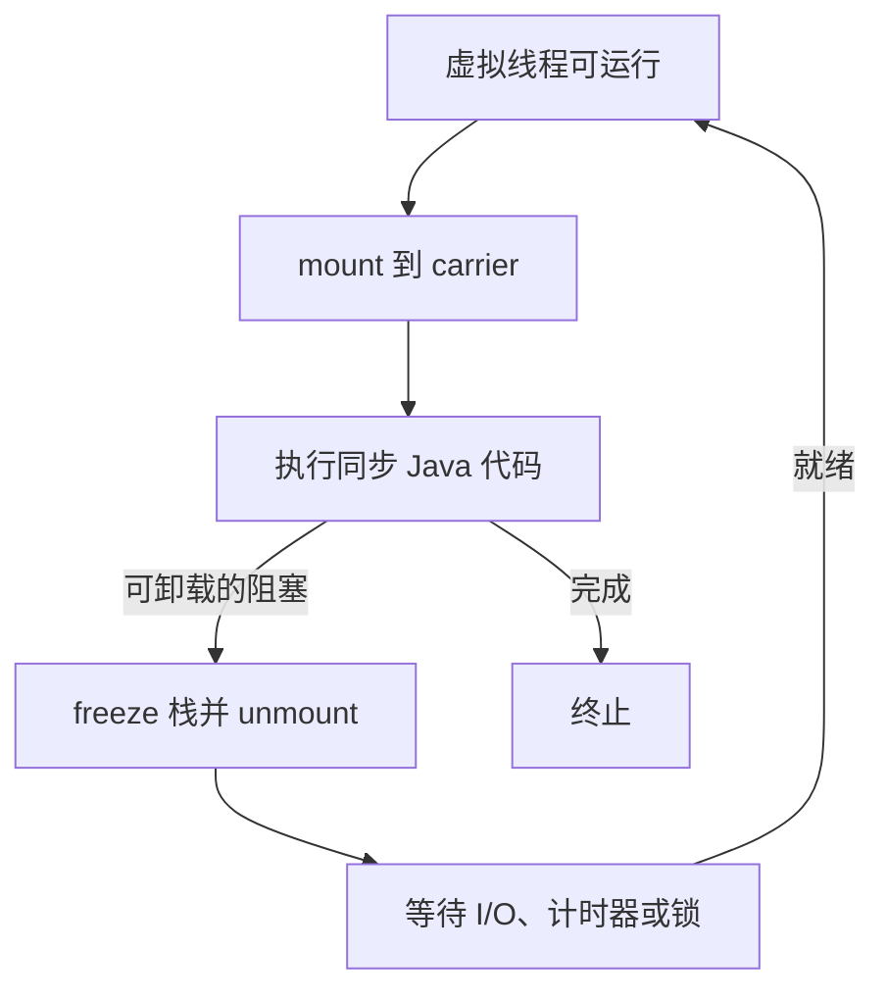
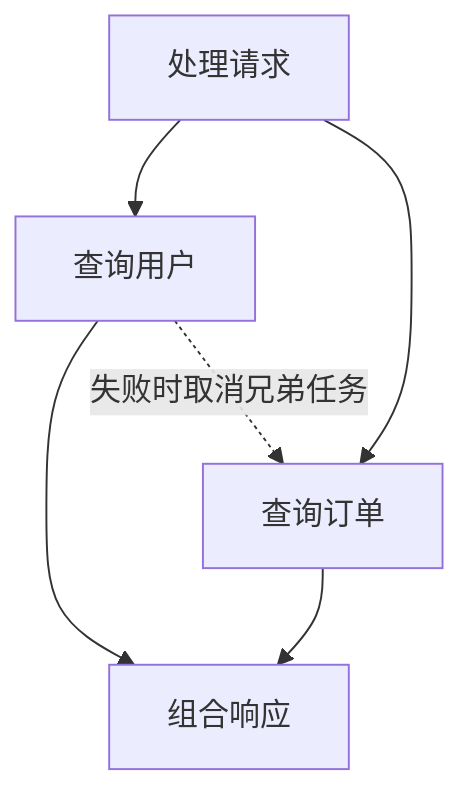

Java 早期最成功的并发抽象，其实不是线程池，也不是 `CompletableFuture`，而是最普通的同步代码：一个请求进入一个线程，方法调用形成调用栈，阻塞、异常、`try/finally` 和调试器都沿着这条栈工作。

它的问题不是难懂，而是贵。

平台线程通常一一映射到操作系统线程。创建大量线程会消耗 native stack、内核调度资源和上下文切换成本，于是服务器不得不用线程池限制线程数，再把等待中的工作改写为 callback、future 或 reactive pipeline。资源问题被缓解了，但控制流被拆散了。

Project Loom 的选择不是发明另一套异步语法，而是改变 `Thread` 的实现成本：让 JVM 管理大量轻量级虚拟线程，并在它们阻塞时把少量操作系统线程让给别的任务。

一句话概括 Loom：

> 保留同步、顺序、带栈的编程模型，把“任务”与“操作系统线程”解耦。

虚拟线程从 JDK 21 起成为正式特性。理解它不能只停留在 `Thread.ofVirtual()`，真正的边界在 continuation、栈迁移、调度器、阻塞点和资源背压。

## 三种角色：任务、虚拟线程与载体线程

先把最容易混淆的对象分开：

| 角色 | 由谁管理 | 数量级 | 作用 |
|---|---|---:|---|
| 虚拟线程 virtual thread | JVM | 可达十万、百万级 | 承载一个顺序执行的任务与 Java 调用栈 |
| 载体线程 carrier thread | JVM + OS | 通常接近可用 CPU 数 | 暂时执行某个虚拟线程 |
| 平台线程 platform thread | OS | 通常较少 | 传统 Java 线程，直接对应内核线程 |

虚拟线程不是永远绑定在某个 carrier 上。运行时，它会被 **mount** 到 carrier；遇到 JVM 能识别的等待点时，它保存执行状态并 **unmount**；条件满足后再由调度器安排到某个 carrier，可能不是原来的那一个。



carrier 是实现细节，不是业务身份。`Thread.currentThread()` 看到的是当前虚拟线程；`ThreadLocal` 也属于虚拟线程，而不是某次恰好承载它的平台线程。

这解释了两个常见误区：

- 虚拟线程不是“把一个 Java 线程切成很多线程”；每个虚拟线程仍有独立身份、栈、异常和中断状态。
- mount/unmount 不是 OS context switch；多数调度动作发生在 JVM 用户态，但恢复执行最终仍需要 carrier 获得 CPU。

## Continuation：可暂停、可恢复的带栈计算

Loom 的底层概念是 continuation。可以把它理解为：

> 一段能够在特定安全点暂停，并在以后从同一位置继续的计算，以及它尚未完成的调用栈。

HotSpot 内部使用 continuation 支撑虚拟线程。它不是面向普通业务代码的稳定公共 API，也不应该通过 `jdk.internal.vm.Continuation` 建立应用依赖。

假设调用链是：

```text
handleRequest
  └─ loadOrder
       └─ HttpClient.send
            └─ 等待 socket
```

传统平台线程阻塞时，这条调用栈仍占着该 OS 线程。虚拟线程阻塞时，JVM 可以冻结 continuation：记录程序计数位置、局部变量、操作数和栈帧，再释放 carrier 去运行别的虚拟线程。

等 socket 就绪，continuation 被恢复，`HttpClient.send` 像普通阻塞方法一样返回。调用者不需要把后半段逻辑手写成 callback。

这是一种 **stackful** 模型：暂停点可以藏在深层库调用中，调用链本身就是状态。它与编译器把函数改写为状态机的 stackless coroutine 有根本差异。

## 栈去了哪里：从 native stack 到 heap stack chunk

虚拟线程不能为每个任务永久预留一个固定大小的 native stack，否则百万线程依旧不可行。

HotSpot 将未挂载 continuation 的栈帧保存在 Java heap 中的 **stack chunk**。其关键性质是：

- 按需要增长，而非启动时为每个线程预留巨大连续栈；
- continuation 冻结时，活跃帧可从 carrier stack 复制或编码进 heap chunk；
- 恢复时，帧重新参与执行；
- heap 中的对象引用对 GC 可见，GC 能正确扫描和更新；
- 不活跃任务的栈也会占 heap，只是通常比同数量 native stack 更紧凑、更弹性。

“虚拟线程几乎不要内存”因此是错误表述。每个虚拟线程仍有 `Thread` 对象、栈块、局部对象、`ThreadLocal` map 和排队状态。十万个等待任务若各自保留大对象、深调用栈或昂贵的 `ThreadLocal`，heap 一样会迅速膨胀。

栈块还影响性能判断：

- 深栈、递归和大量引用会增加冻结、扫描和保留成本；
- 高频 park/unpark 会产生调度开销；
- 任务虽轻，任务携带的数据未必轻；
- GC 与 heap sizing 仍是容量规划的一部分。

虚拟线程解决的是平台线程稀缺性，不是让并发状态变成零成本。

## 调度器：不是 commonPool，也不承诺公平

虚拟线程默认由 JDK 内部专用的 `ForkJoinPool` 调度，采用 work-stealing。它与 `ForkJoinPool.commonPool()` 不是同一个池。

调度目标是高吞吐地让可运行虚拟线程占用有限 carrier，而不是给每个任务相同时间片或提供业务级公平。默认并行度通常以可用处理器数为基础，可通过实现相关的系统属性调节，但这不应成为掩盖阻塞、pinning 或 CPU 过载的第一手段。

需要区分两个数量：

- **concurrency**：同时处于进行中、可能大部分在等待的任务数；
- **parallelism**：此刻真正占用 CPU 执行的任务数。

虚拟线程可以显著提高前者，不会凭空提高后者。8 核机器启动十万个 CPU 密集任务，仍然只有大约 8 个核在工作，还会额外制造排队和内存压力。

因此：

- I/O 密集、阻塞占比高的独立任务适合 virtual-thread-per-task；
- CPU 密集计算仍应使用与核心数匹配的有界执行器、Fork/Join 或并行算法；
- 不要为了“复用”而建立虚拟线程池，虚拟线程本来就是按任务创建和销毁的；
- 要限制的是数据库连接、远端配额和内存等稀缺资源，而不是虚拟线程对象数量。

## 阻塞为什么不再等于占住 OS 线程

虚拟线程的价值依赖 JDK 与运行时对阻塞操作的配合。

当虚拟线程执行支持 Loom 的阻塞操作，例如 `Thread.sleep`、`LockSupport.park`、大多数 JDK 网络 I/O 或 `java.util.concurrent` 同步器等待时，运行时可以：

1. 注册 I/O 就绪、计时器或唤醒条件；
2. 保存 continuation；
3. 从 carrier 上卸载虚拟线程；
4. 用该 carrier 执行其他可运行任务；
5. 条件满足后重新调度原虚拟线程。

这不是把阻塞 API 偷偷改成忙轮询。底层通常仍使用 epoll、kqueue、IOCP 等操作系统设施，只是就绪事件恢复的是虚拟线程，而不是唤醒一个始终被占用的平台线程。

最简单的执行器写法是：

```java
import java.util.concurrent.Executors;
import java.util.concurrent.Future;

try (var executor =
         Executors.newVirtualThreadPerTaskExecutor()) {
    Future<String> user = executor.submit(
        () -> loadUser("u-42")
    );
    Future<String> orders = executor.submit(
        () -> loadOrders("u-42")
    );

    render(user.get(), orders.get());
}
```

这里仍需设计超时、取消与失败传播；虚拟线程只降低等待成本，不会自动赋予一组 `Future` 结构化生命周期。

## 不是所有阻塞都能自动卸载

“任何 blocking call 都会释放 carrier”同样不准确。

JVM 必须知道当前操作如何挂起、何时恢复。对 JDK 已适配的 Java I/O，它可以把等待接入 poller；对任意 native library 调用、JNI/FFM downcall 或操作系统驱动，JVM 通常不能在函数执行一半时保存 native stack，再把同一个 native frame 搬到另一个 carrier。

因此长时间 native blocking call 可能持续占用 carrier。FFM 与 Loom 能同时使用，但 Panama 不会自动把任意 C 函数变成 Loom-aware 异步 I/O。

还要区分：

- **阻塞但可卸载**：虚拟线程停下，carrier 继续服务别人；
- **pinning**：虚拟线程停下时不能从 carrier 卸载；
- **CPU 长任务**：虚拟线程没有阻塞，持续占用 carrier。

三者的症状都可能是吞吐下降，但修复方式完全不同。

## Pinning：JDK 21 的经验不能原样套到今天

虚拟线程被 pin 在 carrier 上，指的是 continuation 当前不能安全卸载。早期 Loom 最著名的限制是：虚拟线程在 `synchronized` 代码块中阻塞时会 pin carrier。

这导致 JDK 21 时代形成了一条流行建议：把可能阻塞的 `synchronized` 改成 `ReentrantLock`。

JEP 491 在 JDK 24 交付后，HotSpot 可以在虚拟线程持有 monitor 时完成大多数阻塞与卸载；“为了虚拟线程一律移除 `synchronized`”已经过时。

但这不代表锁设计不重要：

- 长临界区仍会制造竞争和尾延迟；
- 在锁内调用慢数据库或远端服务仍会让其他线程排队；
- native/foreign frame 与少数 VM 内部临界区仍可能形成 pinning 边界；
- monitor 不再 pin carrier，不等于 monitor 自动拥有公平性或取消语义。

正确的升级思路是：先确认目标 JDK，再通过 JFR 和压测判断真实 pinning/阻塞，而不是机械地把所有 monitor 重写为显式锁。

## ThreadLocal、ScopedValue 与百万线程的上下文成本

虚拟线程支持 `ThreadLocal`，这保证了旧框架兼容性，但“支持”不等于“适合无限使用”。

平台线程池只有几百个线程时，一个每线程 1 MB 的缓存已经危险；换成十万个虚拟线程会成为灾难。虚拟线程也通常不会被复用，所以依赖 thread-pool reuse 的对象缓存可能同时失去收益并放大内存。

请求 ID、租户、安全主体这类只读上下文更适合 `ScopedValue`。它在 JDK 25 正式成为标准 API：

```java
import java.lang.ScopedValue;

static final ScopedValue<String> REQUEST_ID =
    ScopedValue.newInstance();

void handle(String requestId) {
    ScopedValue.where(REQUEST_ID, requestId)
        .run(() -> service());
}

void service() {
    log.info("request={}", REQUEST_ID.get());
}
```

`ScopedValue` 的关键不只是更快，而是语义更窄：绑定不可变，只在明确的动态作用域内可见，退出作用域自动恢复。它适合上下文传播，不适合作为可变全局袋子。

选择可以简化为：

| 需求 | 更合适的工具 |
|---|---|
| 兼容旧库的线程上下文 | `ThreadLocal`，但控制单线程占用 |
| 词法作用域内的只读请求上下文 | `ScopedValue` |
| 显式业务参数 | 普通方法参数，仍是最清楚的选择 |
| Kotlin 协程上下文 | `CoroutineContext`，不要假设自动等于 Java ThreadLocal |

## 结构化并发：线程便宜之后，生命周期还要成树

如果方法派生两个子任务，理想语义是：父任务返回前，子任务要么成功、要么失败、要么被取消；不能无声逃出调用范围。

这就是结构化并发要解决的问题。它把一组相关线程视为一个工作单元，让 join、失败传播、取消和观测重新对应代码的词法结构。



截至 JDK 27，`StructuredTaskScope` 仍是第七轮预览 API，而虚拟线程本身早已稳定。生产代码要区分这两个成熟度，不要把“Loom 已正式可用”扩张成“所有 Loom API 都已定型”。

即使暂时不用预览 API，也应保留结构化原则：

- 一个请求创建的任务应在请求结束前归并；
- 兄弟任务之一失败时，明确是否取消其他任务；
- 超时属于整个操作还是单个下游调用，要写进结构；
- 不在方法内部偷偷 `submit` 后丢弃 handle；
- 中断必须沿调用链得到尊重。

## 取消不是杀死线程

Java 虚拟线程沿用 `Thread` 的 interruption 模型。`interrupt()` 是协作信号，不是安全的强制终止。

能响应中断的 JDK 阻塞方法通常抛出 `InterruptedException`；业务代码捕获后需要完成清理、传播取消，或恢复中断标志：

```java
try {
    return queue.take();
} catch (InterruptedException cancelled) {
    Thread.currentThread().interrupt();
    throw new RequestCancelledException(cancelled);
}
```

以下代码会破坏结构化取消：

```java
try {
    return remoteCall();
} catch (InterruptedException ignored) {
    return fallback();
}
```

如果 native 调用、第三方驱动或 CPU 循环不响应中断，虚拟线程也不能魔法般将其安全终止。超时只是发出边界信号；底层资源是否真的释放，取决于协议、驱动和代码是否支持取消。

## 背压：线程不稀缺，数据库连接仍然稀缺

线程池长期承担了两个不同职责：

1. 复用昂贵的平台线程；
2. 用固定队列和线程数限制进入下游的并发。

虚拟线程消除了第一个理由，没有消除第二个需求。

假设数据库连接池只有 50 条连接。启动 100,000 个虚拟线程不会得到更多数据库吞吐，只会产生 99,950 个等待者。等待本身变便宜了，但 queueing latency、超时风暴和上游内存仍然存在。

对稀缺资源，应直接表达许可：

```java
import java.util.concurrent.Semaphore;

final class PartnerClient {
    private final Semaphore permits =
        new Semaphore(100);

    Response call(Request request)
            throws InterruptedException {
        permits.acquire();
        try {
            return blockingCall(request);
        } finally {
            permits.release();
        }
    }
}
```

这比创建“100 个虚拟线程的池”更准确：限制的是 partner 同时承受的请求数，而不是执行载体。

容量规划仍可从 Little 定律开始：

$$L = \lambda W$$

若每秒进入 2,000 个请求，平均端到端停留 0.5 秒，系统内平均约有 1,000 个进行中请求。虚拟线程让这 1,000 个请求更容易以同步代码存在，却不会改变远端延迟、连接数和内存占用。

## 与 Kotlin 协程的根本区别

二者都能用少量 OS 线程承载大量等待任务，但到这里相似性就快结束了。

| 维度 | Java 虚拟线程 | Kotlin 协程 |
|---|---|---|
| 转换发生处 | JVM/HotSpot 运行时 | Kotlin 编译器把 `suspend` 函数改写为状态机 |
| 栈模型 | stackful，有普通 Java 调用栈 | 逻辑上 stackless，continuation 保存状态 |
| 暂停标记 | 普通阻塞 API 可透明挂起 | 只有挂起函数与显式挂起点 |
| 调度载体 | JVM virtual-thread scheduler / carrier | `CoroutineDispatcher` |
| 上下文 | `ThreadLocal`、`ScopedValue` | `CoroutineContext` |
| 取消 | `Thread.interrupt`，协作式 | `Job` 层级取消，协作式 |
| 结构化并发 | API 在演进，JDK 27 仍为预览 | `coroutineScope`/`supervisorScope` 已是核心模型 |
| Java 兼容性 | 现有同步库常可直接受益 | 阻塞 Java 调用仍会占 dispatcher 线程，需隔离 |

Kotlin `suspend` 函数大致会被编译成带 label 的状态机。每次挂起把局部状态放入 continuation object，恢复时跳转到相应分支。它不会保存一条任意深的 native/JVM stack，因此只有协程生态知道哪些调用能挂起。

Java 虚拟线程不要求方法染上 `suspend` 颜色。一个深层 JDBC 调用可以保持同步签名，只要底层阻塞路径与 Loom 配合，虚拟线程就能卸载 carrier。这给遗留 Java 生态带来很强的透明兼容性。

反过来，Kotlin 协程提供更明确的 `Job` 树、dispatcher 选择、supervision 和 channel/flow 组合能力。Java 虚拟线程的优势是“普通线程语义变便宜”，不是自动拥有完整的协程抽象。

### 两者可以共存，但不能混为一谈

Kotlin/JVM 可以创建虚拟线程，协程 dispatcher 也可以基于虚拟线程执行。但要先回答：

- 代码主要依赖阻塞 Java 库，还是原生 suspending library；
- 取消由 `Job` 还是 `interrupt` 主导，边界如何转换；
- `ThreadLocal`、MDC 与 `CoroutineContext` 如何传播；
- 是否真的需要双重调度层；
- profiler 和 thread dump 中如何识别任务。

如果一个 Ktor 服务已经端到端使用 suspending I/O，迁移到虚拟线程未必获得收益。如果一个 Kotlin/Spring 服务主要调用 JDBC、同步 HTTP client 与遗留 Java SDK，virtual-thread-per-request 可能显著简化容量模型。

## Web 框架中的意义：回到 thread-per-request，但不是回到旧成本

Spring MVC、Servlet、JDBC 一类同步栈天然适合虚拟线程：每个请求保留一条顺序调用链，阻塞时卸载 carrier。异常栈、断点、`try/finally` 和 transaction boundary 都保持熟悉形态。

但启用虚拟线程后需要重新审查：

- 线程池曾经提供的并发上限是否消失；
- 数据库、Redis、HTTP client 连接池是否成为显性瓶颈；
- framework/filter 中是否有巨大的 `ThreadLocal`；
- synchronized 临界区、native SDK 和老驱动是否在目标 JDK 上表现良好；
- shutdown 时是否能取消并等待进行中的请求。

对 Netty、Vert.x 等 event-loop 架构，规则没有反转：event-loop 线程仍不能被阻塞。可以把阻塞 handler 放进虚拟线程，但不能因为“项目用了 Loom”就在 event loop 上直接调用 JDBC。事件循环对高效多路复用、流式协议和显式背压仍然有价值。

## 可观测性：不要只盯 carrier

平台线程时代，线程 dump 中几百个线程通常还能逐个阅读；几十万虚拟线程若按传统格式完整打印，文件本身就可能成为事故。

现代 JDK 提供面向大量虚拟线程的 thread dump 与 JFR 事件。诊断时应关注：

- 虚拟线程数量与创建速率；
- runnable、parked、waiting 的分布；
- carrier 利用率与 CPU 饱和；
- pinning 与长时间 native call；
- 任务保留的 heap、ThreadLocal 和 stack chunk；
- 下游连接池等待与请求超时；
- 结构化任务之间的父子关系。

可使用 `jcmd` 输出 JSON thread dump，避免把海量线程强行压成旧式文本：

```bash
jcmd <pid> Thread.dump_to_file \
  -format=json threads.json
```

JFR 更适合持续观察虚拟线程启动、结束、pinning 等事件；async-profiler 适合回答 CPU、allocation、lock 与 wall-clock 时间花在哪里。分析 flame graph 时要明确采样的是虚拟线程任务还是 carrier 执行，否则很容易只看到少量平台线程名字，误以为并发消失了。

## 怎么做基准：Loom 优化的是扩展性，不是单次调用速度

一个只启动 100 个任务的 microbenchmark 很难说明虚拟线程价值。评估应覆盖真实等待比例和资源上限：

1. 固定请求率，逐步增加并发连接；
2. 分别测 CPU、JDBC、HTTP、文件与 native blocking；
3. 记录吞吐、p50/p99/p999、超时和取消耗时；
4. 同时记录 carrier CPU、heap、GC、stack chunk、连接池等待；
5. 比较平台线程池时保持下游并发许可一致；
6. 在 JDK 21 与 JDK 24+ 间比较时单独说明 JEP 491 的影响；
7. 加入故障场景：慢下游、半开连接、批量取消和关闭。

虚拟线程创建通常比平台线程便宜，但单个任务不一定运行得更快。它的主要收益是：大量等待任务可以保持简单同步结构，而不因 OS 线程数量先撞墙。

## 生产落地检查表

### 适用性

- 任务是否以 I/O 等待为主，而非长时间 CPU 运算；
- 同步代码是否比 callback/reactive 链更容易维护；
- 依赖的 JDBC、HTTP、文件 I/O 与框架是否已在目标 JDK 验证；
- native/foreign 调用是否可能长期阻塞 carrier。

### 资源与背压

- 数据库连接、远端 QPS、文件描述符与内存有独立上限；
- 不用固定大小虚拟线程池冒充资源限流；
- 队列、Semaphore 和 timeout 对应真实稀缺资源；
- 批量请求和重试不会瞬间创建无界在途任务。

### 上下文与取消

- 审计每个 `ThreadLocal` 的单线程内存与清理行为；
- 只读动态上下文优先评估 `ScopedValue`；
- 捕获 `InterruptedException` 后不静默吞掉取消；
- shutdown、timeout 与兄弟任务失败有明确传播路径。

### 观测与性能

- 使用支持虚拟线程的 JFR、jcmd、profiler 与 APM 版本；
- 分开观测虚拟线程、carrier、连接池和下游延迟；
- 压测包含目标 JDK、目标容器 CPU quota 与真实依赖；
- 不用“线程数下降”或“代码更短”替代吞吐和尾延迟数据。

## 结论：Loom 改的是成本模型，不是并发定律

Project Loom 最经典的贡献，是让 Java 重新拥有可扩展的 thread-per-task 模型：

- continuation 让一条带栈计算可以暂停与恢复；
- stack chunk 让大量非活跃调用栈进入 heap，而不是长期占用 native stack；
- mount/unmount 让少量 carrier 承载大量等待中的虚拟线程；
- JDK I/O 与同步器把可识别的等待接入调度器；
- JEP 491 消除了 `synchronized` 对虚拟线程最常见的历史 pinning 限制；
- ScopedValue 和结构化并发补上上下文与任务生命周期模型。

但 CPU、连接、内存、下游配额、锁竞争和取消合作都没有消失。虚拟线程不是更快的线程，也不是 JVM 版 Kotlin 协程；它是一种由运行时实现的 stackful thread，让普通阻塞代码不再天然等于占用一个操作系统线程。

最成熟的使用方式不是把所有 executor 名称替换成 virtual，而是重新画出系统里真正稀缺的资源：线程不再是主要阀门之后，背压、超时、结构化生命周期和可观测性必须接过这个职责。

## 延伸阅读

- [JEP 444：Virtual Threads](https://openjdk.org/jeps/444)
- [JEP 491：Synchronize Virtual Threads without Pinning](https://openjdk.org/jeps/491)
- [JEP 506：Scoped Values](https://openjdk.org/jeps/506)
- [JEP 533：Structured Concurrency（Seventh Preview）](https://openjdk.org/jeps/533)
- [OpenJDK Project Loom](https://openjdk.org/projects/loom/)
- [Java 25 Core Libraries Guide：Virtual Threads](https://docs.oracle.com/en/java/javase/25/core/virtual-threads.html)
